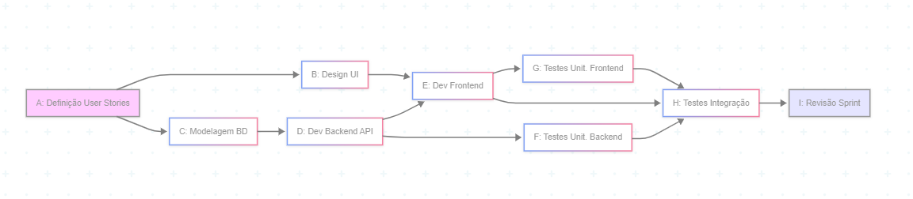

***Alunos:*** 
* Eduardo Schneider
* Bernardo Roorda 

---

**1) Concepção do Projeto Prático Avaliativo:**

**Lista Principais Funcionalidades:**

*   **Módulo de Autenticação e Usuários (Doador):**
    *   Cadastro de Doador (Nome, Email, Senha).
    *   Login para Doadores.
    *   Recuperação de Senha.
*   **Home Page e Listagem de ONGs:**
    *   Apresentação da plataforma.
    *   Listagem de ONGs cadastradas pelo Admin (sem filtros avançados inicialmente, talvez uma busca simples por nome).
    *   Página de detalhe de cada ONG (informações básicas carregadas pelo Admin).
*   **Dashboard do Doador (Simplificado):**
    *   Visualização do saldo de pontos.
    *   Histórico de compras de pontos (essencial).
    *   Histórico de doações de pontos realizadas (essencial).
    *   *Removido/Adiado:* Gerenciamento avançado de perfil.
*   **Módulo de Compra de Pontos (Pagamento):**
    *   Seleção de pacotes de pontos (fixos).
    *   Integração com gateway de pagamento (foco em UMA forma principal, ex: Cartão via Stripe).
    *   Confirmação de compra e atualização do saldo.
*   **Módulo de Doação de Pontos:**
    *   Selecionar ONG da lista.
    *   Inserir quantidade de pontos a doar.
    *   Confirmação da doação.
    *   *Simplificação:* Notificação para ONG pode ser manual pelo Admin ou um e-mail muito simples e padronizado, sem dashboard próprio para a ONG nesta fase.
*   **Painel Administrativo (MUITO BÁSICO):**
    *   Cadastro/Edição manual de ONGs (pode ser direto no BD ou interface ultra simples).
    *   Visualização de doações totais por ONG (para repasse manual fora da plataforma).
    *   *Removido/Adiado:* Gerenciamento de usuários doadores, configurações da plataforma, repasses automatizados, gestão de conteúdo complexa.

---

**2) Gerenciamento do Escopo:**

**Estrutura Analítica de Projeto (EAP) - Hierárquica (até segundo nível) - AJUSTADA**

1.  **Gerenciamento do Projeto**
    1.1. Planejamento e Definição do Escopo MVP
    1.2. Acompanhamento e Controle Ágil
2.  **Design e UX/UI (Essencial)**
    2.1. Wireframes e Fluxos de Usuário (Core)
    2.2. Design Visual (UI) das Telas Essenciais
3.  **Desenvolvimento Backend (Core MVP)**
    3.1. Configuração do Ambiente (Prisma, Next.js API, Railway)
    3.2. Modelagem do Banco de Dados (Simplificada)
    3.3. Desenvolvimento de APIs Essenciais (Doador, ONGs-leitura, Pontos, Pagamento-core, Doações)
    3.4. Implementação da Lógica de Negócio Essencial e Segurança Básica
4.  **Desenvolvimento Frontend (Core MVP)**
    4.1. Configuração do Ambiente (Next.js Pages)
    4.2. Desenvolvimento das Telas Essenciais (Login, Cadastro Doador, Home, Detalhe ONG, Compra Pontos, Doação, Dashboard Doador Simples)
    4.3. Integração com APIs do Backend (Essenciais)
    4.4. Implementação da Responsividade Básica
5.  **Integrações (Críticas)**
    5.1. Integração com Gateway de Pagamento (Simplificada)
6.  **Testes (Focados no Caminho Feliz)**
    6.1. Testes Unitários (Desenvolvedor)
    6.2. Testes de Integração (Core Flows)
    6.3. Testes de Usabilidade (UAT Rápido com Admin)
7.  **Implantação e Configuração (Simplificada)**
    7.1. Configuração do Ambiente de Produção (Railway)
    7.2. Deploy da Aplicação MVP
8.  **Documentação (Mínima Essencial)**
    8.1. Documentação Técnica Chave (para continuidade)

---

**3) Gerenciamento do Tempo:**

*   **Estimativa de Recursos e Durações (colunas adicionadas à EAP) - AJUSTADA PARA ~65 DIAS**
*   **Estimativa do Custo em Horas (coluna adicionada à EAP - será preenchida em Gerenciamento de Custos)**
*   **Matriz de Responsabilidades (RACI - coluna adicionada à EAP - será preenchida em Gerenciamento de RH)**

    | Atividade (EAP Nível 2 - Ajustada)                       | Duração Estimada (dias úteis)    | Recursos Principais Designados | Custo Estimado (Horas) | Responsável (R) | Accountable (A) | Consultado (C) | Informado (I) |
    | :------------------------------------------------------- | :------------------------------- | :----------------------------- | :--------------------- | :-------------- | :-------------- | :------------- | :------------ |
    | Planejamento e Definição do Escopo MVP                   | 3                                | GP, Dev Lead                   | 24                     | GP              | GP              | Dev Lead, UX   | Stakeholders  |
    | Acompanhamento e Controle Ágil                           | Contínuo (65)                    | GP                             | 65 (1h/dia)            | GP              | GP              | Time           | Stakeholders  |
    | Wireframes e Fluxos de Usuário (Core)                    | 4                                | UX Designer                    | 32                     | UX              | GP              | Dev Lead       |               |
    | Design Visual (UI) das Telas Essenciais                  | 6                                | UX/UI Designer                 | 48                     | UX/UI           | GP              | Dev Lead       |               |
    | Configuração do Ambiente (Prisma, Next.js API, Railway)  | 2                                | Dev Fullstack                  | 16                     | Dev FS          | Dev Lead        |                | GP            |
    | Modelagem do Banco de Dados (Simplificada)               | 3                                | Dev Fullstack                  | 24                     | Dev FS          | Dev Lead        |                | GP            |
    | Desenvolvimento de APIs Essenciais                       | 12                               | Dev Fullstack                  | 96                     | Dev FS          | Dev Lead        |                | GP            |
    | Implementação da Lógica de Negócio Essencial e Segurança | 8                                | Dev Fullstack                  | 64                     | Dev FS          | Dev Lead        |                | GP            |
    | Configuração do Ambiente (Next.js Pages)                 | 1                                | Dev Fullstack                  | 8                      | Dev FS          | Dev Lead        |                | GP            |
    | Desenvolvimento das Telas Essenciais                     | 15                               | Dev Fullstack                  | 120                    | Dev FS          | Dev Lead        | UX/UI          | GP            |
    | Integração com APIs do Backend (Essenciais)              | 8                                | Dev Fullstack                  | 64                     | Dev FS          | Dev Lead        |                | GP            |
    | Implementação da Responsividade Básica                   | 3                                | Dev Fullstack                  | 24                     | Dev FS          | Dev Lead        | UX/UI          | GP            |
    | Integração com Gateway de Pagamento (Simplificada)       | 5                                | Dev Fullstack                  | 40                     | Dev FS          | Dev Lead        | GP             |               |
    | Testes Unitários (Desenvolvedor)                         | Contínuo (em paralelo com 3 e 4) | Dev Fullstack                  | 20 (total)             | Dev FS          | Dev Lead        |                |               |
    | Testes de Integração (Core Flows)                        | 5                                | QA (ou Dev Fullstack)          | 40                     | QA/Dev FS       | Dev Lead        |                | GP            |
    | Testes de Usabilidade (UAT Rápido com Admin)             | 2                                | GP, Stakeholders               | 8 (GP)                 | GP              | GP              | Stakeholders   | Dev Team      |
    | Configuração do Ambiente de Produção (Railway)           | 1                                | Dev Fullstack/DevOps           | 8                      | Dev FS/DevOps   | Dev Lead        |                | GP            |
    | Deploy da Aplicação MVP                                  | 1                                | Dev Fullstack/DevOps           | 8                      | Dev FS/DevOps   | Dev Lead        |                | GP            |
    | Documentação Técnica Chave                               | 2                                | Dev Lead, Dev Fullstack        | 16                     | Dev Lead        | GP              |                |               |

**Diagrama de Precedência ou Setas (para um Sprint - Exemplo Sprint 1: Autenticação Doador e Home Básica)**

*   **Duração do Sprint:** 2 semanas (10 dias úteis)
*   **Objetivo:** Doador se cadastra, loga, vê home com ONGs (mock/cadastro manual Admin).

**Cronograma do Projeto**

| Atividade Principal (EAP Nível 1/Agrupado) | S1   | S2   | S3   | S4   | S5   | S6   | S7   | S8   | S9   | S10  | S11  | S12  | S13  |                                     |
| :----------------------------------------- | :--- | :--- | :--- | :--- | :--- | :--- | :--- | :--- | :--- | :--- | :--- | :--- | :--- | ----------------------------------- |
| **1. Gerenciamento do Projeto**            | XXX  | XXX  | XXX  | XXX  | XXX  | XXX  | XXX  | XXX  | XXX  | XXX  | XXX  | XXX  | XXX  |                                     |
| **2. Design e UX/UI**                      | XXX  | XX   |      |      |      |      |      |      |      |      |      |      |      |                                     |
| 2.1 Wireframes, 2.2 UI Core                | XXX  | XX   |      |      |      |      |      |      |      |      |      |      |      |                                     |
| **3. Desenvolvimento Backend**             | X    | XXX  | XXX  | XX   | X    |      |      |      |      |      |      |      |      |                                     |
| 3.1 Config, 3.2 Model BD                   | X    | X    |      |      |      |      |      |      |      |      |      |      |      |                                     |
| 3.3 APIs Essenciais                        |      | XX   | XXX  | X    |      |      |      |      |      |      |      |      |      |                                     |
| 3.4 Lógica Negócio Ess.                    |      |      | X    | XX   | X    |      |      |      |      |      |      |      |      |                                     |
| **4. Desenvolvimento Frontend**            |      | X    | XXX  | XXX  | XXX  | XX   | X    |      |      |      |      |      |      |                                     |
| 4.1 Config, 4.2 Telas Ess.                 |      | X    | XXX  | XXX  | XX   |      |      |      |      |      |      |      |      |                                     |
| 4.3 Integração APIs, 4.4 Resp.             |      |      |      | X    | XX   | XX   | X    |      |      |      |      |      |      |                                     |
| **5. Integrações**                         |      |      |      |      | X    | XX   | X    |      |      |      |      |      |      |                                     |
| **6. Testes**                              |      |      | XXX  | XX   | X    |      |      |      |      |      |      |      |      | (Contínuo com Dev Backend/Frontend) |
| 6.2 Testes Integração Core                 |      |      |      |      |      |      |      | XXX  | X    |      |      |      |      |                                     |
| 6.3 UAT Rápido                             |      |      |      |      |      |      |      |      | XX   |      |      |      |      |                                     |
| **7. Implantação e Configuração**          |      |      |      |      |      |      |      |      |      | XX   | X    |      |      |                                     |
| **8. Documentação**                        |      |      |      |      |      |      |      |      |      |      | X    | X    |      |                                     |

---

**4) Gerenciamento dos Custos:**

**Estimativa dos Custos Indiretos para o Projeto:**
*   Software e Assinaturas: R$ 530
*   Infraestrutura: R$ 300
*   Comunicação: R$ 150
*   **Total Custos Indiretos Fixos:** R$ 980

---

**6) Gerenciamento dos Recursos Humanos (AJUSTADO):**

**Diretório do Time de Projeto:**

| Cargo                                             | Área de Atuação                             | Habilidades e Experiências                                                                                 |
| :------------------------------------------------ | :------------------------------------------ | :--------------------------------------------------------------------------------------------------------- |
| **Gerente de Projetos (GP) / Product Owner (PO)** | Gestão, Priorização, Comunicação            | Scrum/Kanban, Liderança, Priorização de Backlog, Comunicação eficaz, Foco no MVP                           |
| **UX/UI Designer**                                | Design Essencial, UX Core                   | Figma/Sketch/XD, Design Rápido e Funcional, Prototipagem Leve, UI para Web                                 |
| **Desenvolvedor Fullstack(Lead)**                 | Backend, Frontend, Arquitetura Simplificada | Next.js, Prisma, React, Typescript, APIs REST, Git, DevOps Básico (Railway), Resolução Rápida de Problemas |
| **Desenvolvedor Fullstack**                       | Backend, Frontend                           | Next.js, React, Typescript, Consumo de APIs, Git                                                           |

---

**7) Gerenciamento das Partes Interessadas:**

| Parte Interessada                 | Expectativas em Relação ao Projeto (Considerando MVP em 65 dias)                                                                                                                     |
| :-------------------------------- | :----------------------------------------------------------------------------------------------------------------------------------------------------------------------------------- |
| **Doadores (Usuários Finais)**    | Plataforma funcional para cadastro, compra de pontos e doação. Segurança nas transações. Clareza sobre para onde o dinheiro vai (mesmo que a ONG não tenha dashboard próprio ainda). |
| **ONGs (Usuárias Finais)**        | Serem cadastradas e receberem doações. Serem informadas sobre as doações recebidas (mesmo que por e-mail do Admin). Confiança no repasse.                                            |
| **Equipe do Projeto**             | Entregar um MVP funcional no prazo. Comunicação intensa e colaboração. Foco e disciplina.                                                                                            |
| **Administradores da Plataforma** | Capacidade de cadastrar ONGs e visualizar doações para realizar repasses manuais. Estabilidade básica do MVP.                                                                        |

---

**8) Gerenciamento das Comunicações (AJUSTADO):**

| Item de Comunicação                          | Recurso / Método Utilizado                                 | Frequência de Comunicação     |
| :------------------------------------------- | :--------------------------------------------------------- | :---------------------------- |
| **Progresso do Sprint / Tarefas Diárias**    | Reuniões Diárias (Daily Scrum - 15 min)                    | Diária (Mandatório)           |
| **Revisão e Planejamento do Sprint**         | Reunião de Revisão e Planejamento (combinada e mais curta) | A cada Sprint (ex: quinzenal) |
| **Relatório de Status do Projeto (Conciso)** | Email curto / Slack Update                                 | Semanal                       |
| **Bloqueios e Impedimentos Críticos**        | Comunicação Imediata (Slack, chamada rápida)               | Conforme Necessário / Urgente |

---